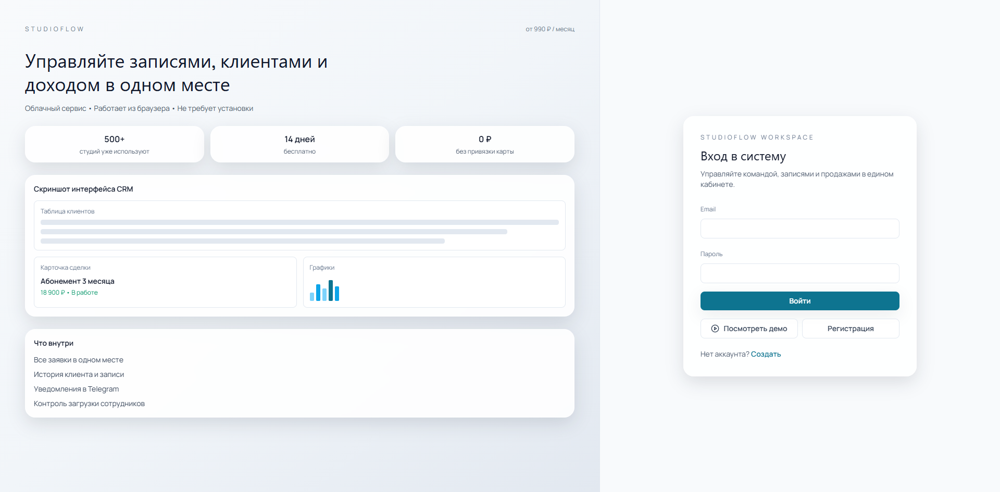
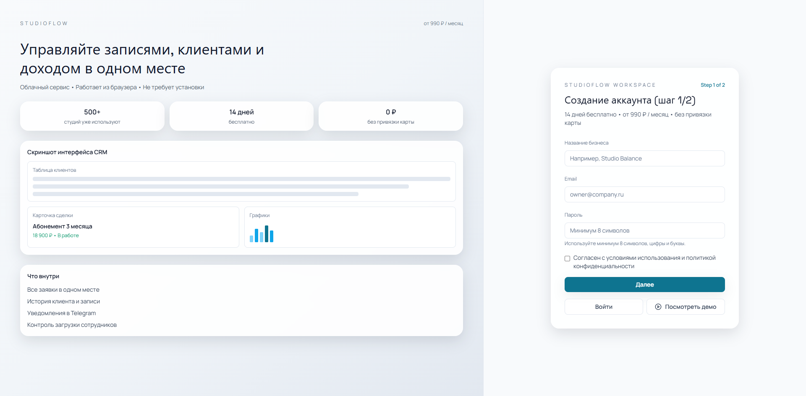
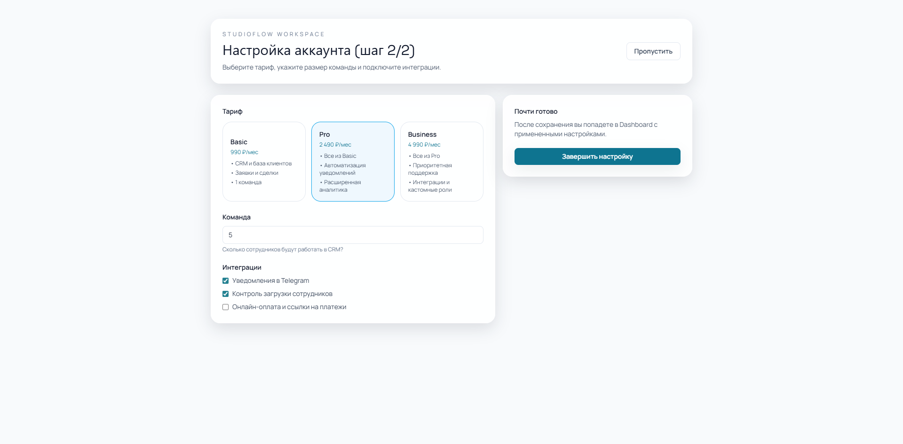
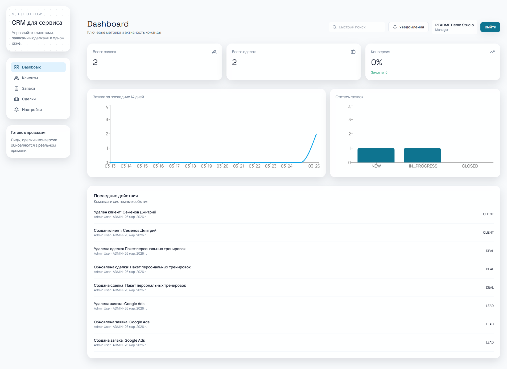
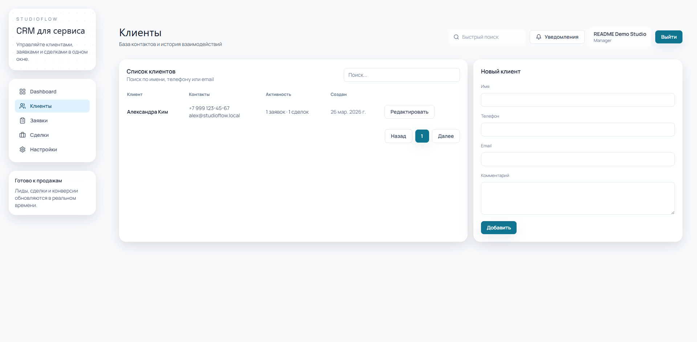
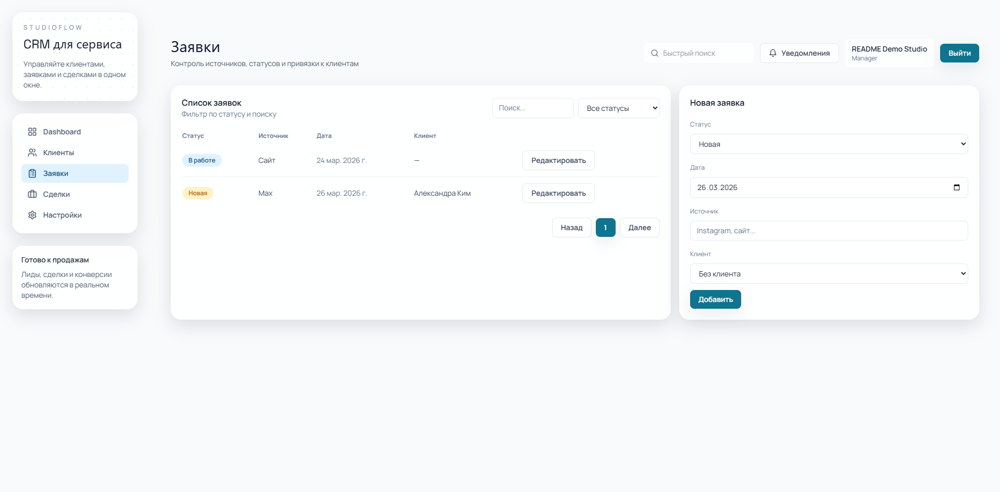
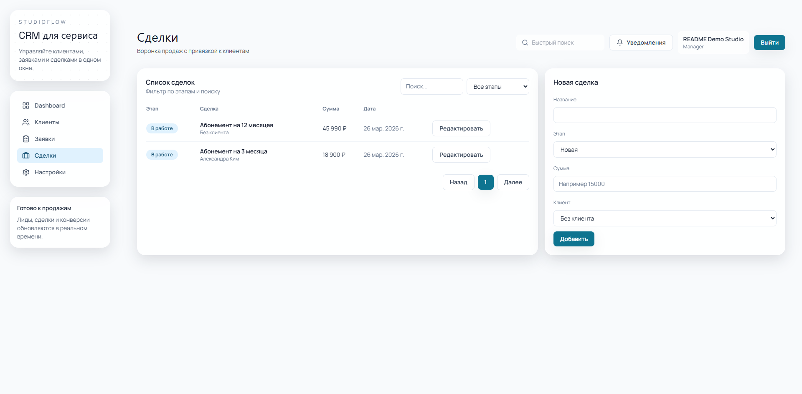

# StudioFlow CRM

StudioFlow CRM is a full-stack SaaS CRM for service businesses (salons, studios, fitness clubs, local teams).

It includes role-based CRM workflows, dashboard analytics, and a two-step onboarding flow with backend persistence.

## Core Features

- JWT authentication: `register`, `login`, `me`
- Roles: `ADMIN`, `MANAGER`
- CRM modules:
  - Clients CRUD
  - Leads CRUD
  - Deals CRUD
- Dashboard:
  - Lead dynamics chart
  - Conversion summary
  - Recent activity feed
- Search, filtering, pagination
- Form validation and API error handling
- SaaS onboarding:
  - Step 1/2: account creation UX
  - Step 2/2: plan, team size, integrations
  - Saved in backend and loaded on revisit

## Tech Stack

- Frontend: React, Vite, Tailwind CSS, Zustand, React Hook Form, Zod, Recharts
- Backend: Node.js, Express, Prisma, Zod
- Database: PostgreSQL
- Auth: JWT
- Infra: Docker Compose

## Project Structure

```text
.
├─ frontend/               # React admin panel
├─ backend/                # REST API
├─ backend/prisma/         # schema + seed
├─ docs/screenshots/       # real UI screenshots
└─ docker-compose.yml      # local full-stack orchestration
```

## REST API

Auth:
- `POST /api/auth/register`
- `POST /api/auth/login`
- `GET /api/auth/me`

Clients:
- `GET /api/clients`
- `POST /api/clients`
- `PATCH /api/clients/:id`
- `DELETE /api/clients/:id` (`ADMIN` only)

Leads:
- `GET /api/leads`
- `POST /api/leads`
- `PATCH /api/leads/:id`
- `DELETE /api/leads/:id` (`ADMIN` only)

Deals:
- `GET /api/deals`
- `POST /api/deals`
- `PATCH /api/deals/:id`
- `DELETE /api/deals/:id` (`ADMIN` only)

Dashboard:
- `GET /api/dashboard/overview`

Onboarding:
- `GET /api/onboarding/step2`
- `PUT /api/onboarding/step2`

Health:
- `GET /api/health`

## Run with Docker

```bash
docker compose up --build
```

Stop and remove volumes:

```bash
docker compose down -v
```

URLs:
- Frontend: `http://localhost:5173`
- API base: `http://localhost:4000/api`
- API health: `http://localhost:4000/api/health`

## Run without Docker

Backend:

```bash
cd backend
cp .env.example .env
npm install
npm run prisma:generate
npm run prisma:migrate
npm run seed
npm run dev
```

Frontend:

```bash
cd frontend
cp .env.example .env
npm install
npm run dev
```

## Seed Credentials

- Email: `admin@studioflow.local`
- Password: `admin123`

## Screenshots

### Login


### Register (Step 1/2)


### Onboarding (Step 2/2)


### Dashboard


### Clients


### Leads


### Deals


## Notes

- `MANAGER` can create and edit entities, but delete actions are restricted to `ADMIN`.
- Leads and deals support client linking directly from forms.
- Onboarding step 2 is persisted in PostgreSQL and can be loaded back for the current user.